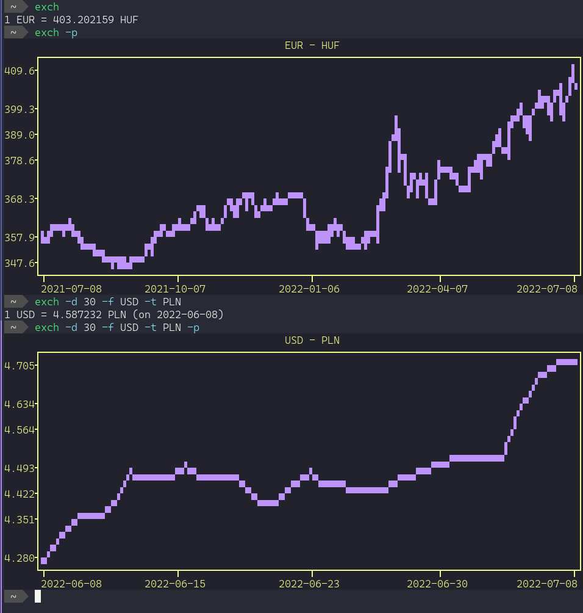

# exch

A command line utility that fetches exchanges rates from [fixer.io](https://apilayer.com/marketplace/fixer-api#documentation-tab).

## Installation

Put make the `exch` executable and place it on your `$PATH`. Python requirements are in `requirements.txt`, i.e. `pip install -r requirements.txt`.

It looks for `$HOME/.config/apilayer/config.yaml`, where you need to put two thing:

```
apikey: [your apilayer API key]
baseurl: https://api.apilayer.com
```

## Features

See help with `exch --help`.


